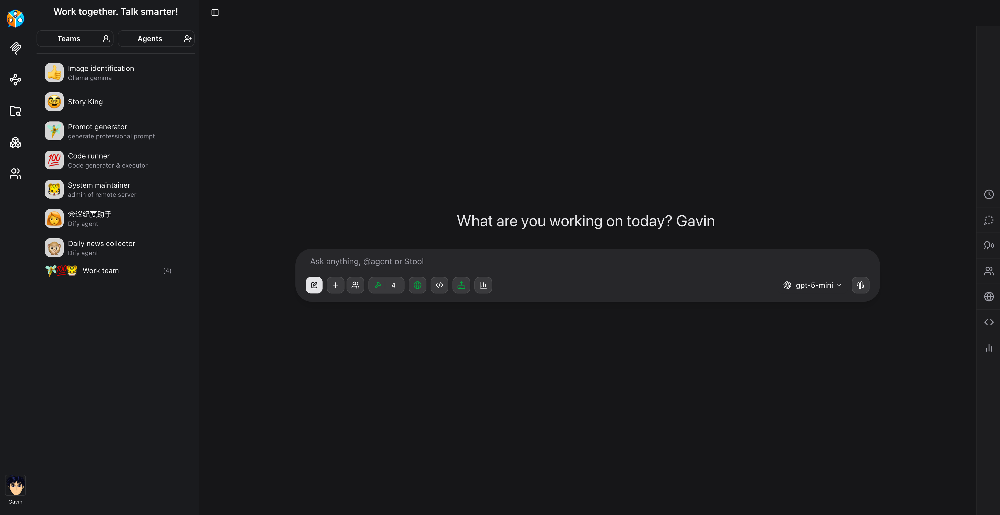
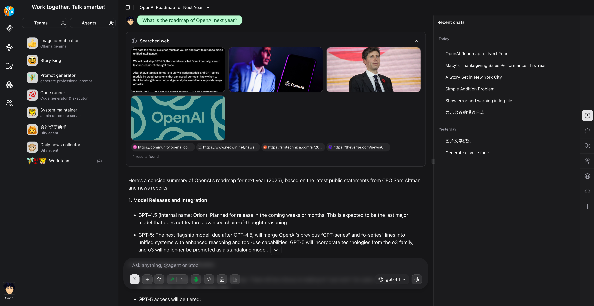
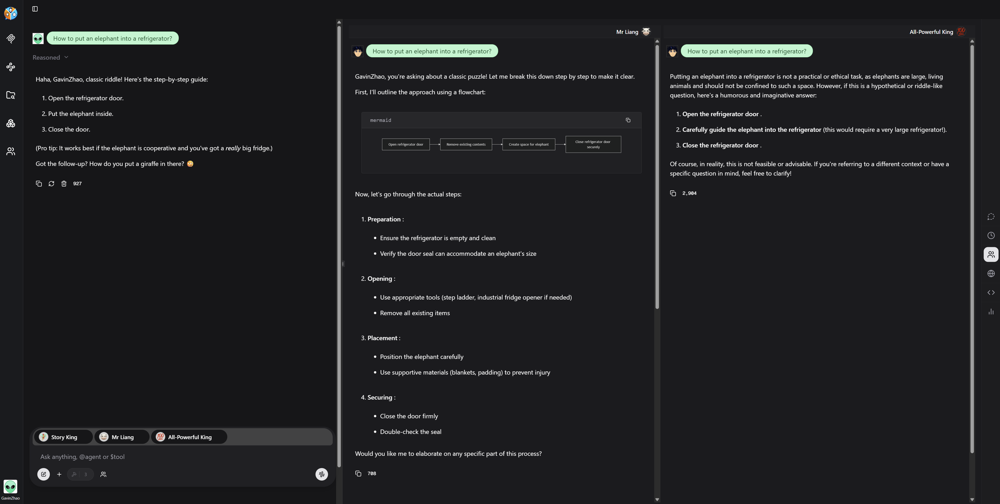
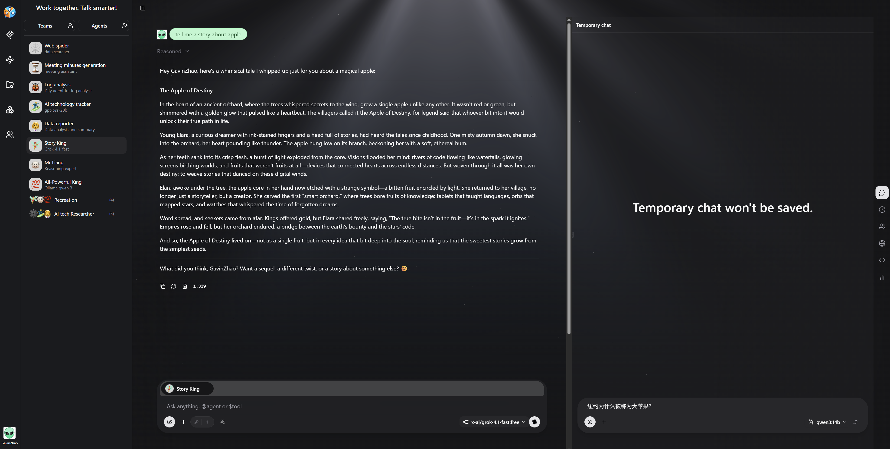
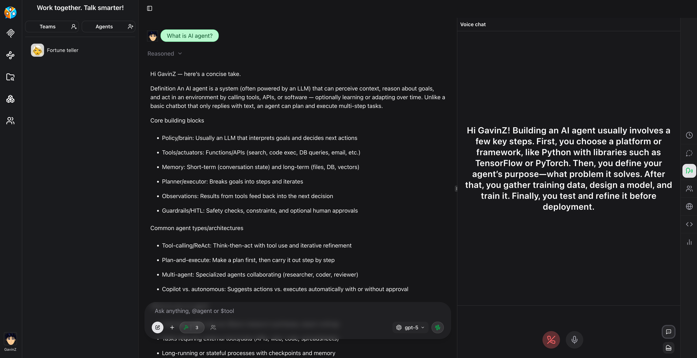
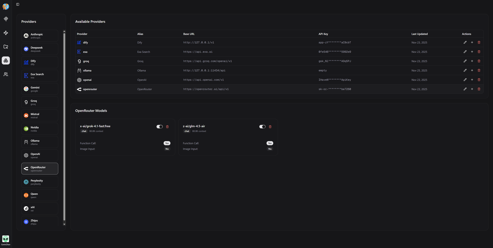
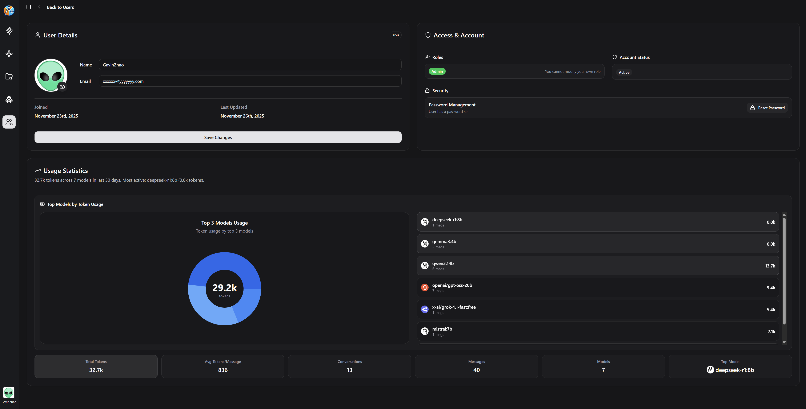

<div align="center">
  <h1>
    
    ChatPie
  </h1>
</div>

<div align="center">
  
</div>

<div align="center">
  <a href="./README.zh.md">中文</a> / <a href="./README.md">English</a>
</div>

<br/>

ChatPie 是一款现代化的 AI 驱动聊天平台，旨在促进无缝的人机协作。ChatPie 将 AI 从简单工具升级为真正的伙伴或同事，让用户能够自然交流、高效工作，与 AI 助手共同完成任务。

## ✨ 关键特性

### 🤖 AI 协作平台
- 增强的聊天界面：直观、友好的聊天体验
- 人机协作：为自然对话和高效协作而设计
- 多用户支持：完整用户管理能力

### 🎯 高级聊天能力
- 多种聊天模式：支持一对一与群聊
- AI 代理构建器：为特定任务创建并定制智能代理
- 工作流构建：搭建自动化流程以简化复杂任务
- 聊天归档与管理：支持可配置的保留策略
- 实时语音聊天：基于 OpenAI `gpt-realtime`（需要 API Key）
- 网络搜索：基于Exa API的增强的搜索能力（需要 API Key）

### 🔌 模型与集成支持
- 多模型支持：通过 Vercel AI SDK 无缝集成
  - OpenAI
  - Anthropic
  - xAI
  - OpenRouter
  - Groq
  - Qwen
  - Dify
  - 以及更多…
- MCP 服务器集成：支持本地与远程 Model Context Protocol（MCP）服务器
- 安全的 API 管理：所有 API Key 由后端管理员安全管理，绝不在前端暴露

### 🌍 用户体验
- 多语言支持：为全球用户提供本地化体验
- 多主题：可自定义的视觉主题
- 灵活认证：多种登录方式，便捷访问

## 📸 屏幕截图

<div align="center">
  <table>
    <tr>
      <td width="50%">
        
        <p align="center"><b>网页搜索</b></p>
      </td>
      <td width="50%">
        
        <p align="center"><b>团队聊天</b></p>
      </td>
    </tr>
    <tr>
      <td width="50%">
        
        <p align="center"><b>临时会话</b></p>
      </td>
      <td width="50%">
        
        <p align="center"><b>语音聊天</b></p>
      </td>
    </tr>
    <tr>
      <td width="50%">
        
        <p align="center"><b>模型提供商</b></p>
      </td>
      <td width="50%">
        
        <p align="center"><b>用户详情</b></p>
      </td>
    </tr>
  </table>
</div>

<p align="center">
  📷 <a href="./public/image/preview">查看更多截图</a>
</p>

## 入门指南

### 一键启动（面向用户的 Docker Compose）🐳

使用预构建镜像与根目录的 `docker-compose.yaml`，无需安装 Node.js 或 pnpm。

```bash
# 在项目根目录执行以下命令
docker compose up -d

# 从浏览器访问
http://localhost:8300
```

镜像来源：

- ChatPie：`ghcr.io/gavinzha0/chatpie:latest`
- PostgreSQL：`postgres:17`

可选配置：

- 在项目根目录创建 `.env` 覆盖 `docker-compose.yaml` 中的默认值：
  - `BETTER_AUTH_SECRET`（请设置你自己的密钥）
  - `BETTER_AUTH_URL`（例如 `http://localhost:8300` 或你的局域网 IP）
  - 数据库配置：设置 `POSTGRES_HOST`、`POSTGRES_USER`、`POSTGRES_PASSWORD`、`POSTGRES_DB`（可选 `POSTGRES_PORT`）


### 本地构建（源码构建的 Docker Compose）🐳

```bash
# 1. 安装依赖
pnpm i

# 2. 使用 Docker Compose 构建并启动所有服务（包含 PostgreSQL）
pnpm docker-compose:up

```

### 启动开发环境（面向开发者）🚀

```bash
pnpm i

#（可选）启动本地 PostgreSQL 实例
# 如果你已在本机运行 PostgreSQL，可跳过此步骤。
# 这种情况下，请在 .env 中更新 PostgreSQL URL。
pnpm docker:pg

# 在 .env 文件中填写必要信息
# .env 会自动创建，只需补充必要值
# 应用数据库迁移
pnpm db:migrate

# 构建并启动应用
pnpm build:local && pnpm start

# （推荐，大多数场景适用，确保 Cookie 设置正确）
# 开发模式（热重载与调试）
# pnpm dev
```

备选：仅使用 Docker Compose 启动数据库（应用通过 pnpm 运行）

```bash
# 仅通过 compose 启动 Postgres
# 确保 .env 包含：POSTGRES_HOST、POSTGRES_USER、POSTGRES_PASSWORD、POSTGRES_DB（或设置 POSTGRES_URL）
docker compose -f docker/compose.yml up -d piedb

# 应用数据库迁移
pnpm db:migrate


# 本地运行应用
pnpm dev   # 或：pnpm build && pnpm start
```

在浏览器中打开 [http://localhost:8300](http://localhost:8300) 即可开始使用。

### 环境变量

用于本地开发时，运行 `pnpm i` 会自动生成 `.env` 文件，请填写必要值。

对于用户版 Docker Compose（项目根目录的 `docker-compose.yaml`），`.env` 为可选；你可以添加一个 `.env` 用来覆盖 Compose 文件中的默认值。

详细的环境变量说明请参阅 [.env.example](./.env.example)。

<br/>

## 💖 支持

如果本项目对你有所帮助，欢迎支持其持续发展：

- ⭐ 为仓库点赞
- 🐛 反馈问题与提出新功能建议
- 💰 成为赞助者，支持长期维护

你的支持将帮助我们持续维护与改进本项目，感谢！🙏

## 🙏 致谢

- Fork 自：https://github.com/cgoinglove/better-chatbot.git
- 特别感谢原作者：[cgoinglove]

## 🙌 贡献

我们欢迎所有形式的贡献！无论是问题反馈、功能创意还是代码改进，都会帮助我们打造更好的本地 AI 助手。

> **⚠️ 提交 Pull Request 或 Issue 前，请先阅读我们的 [贡献指南](./CONTRIBUTING.md)。** 这将帮助我们更高效地协作并节省大家的时间。

**详细贡献说明**请参阅我们的[贡献指南](./CONTRIBUTING.md)。

让我们一起构建更好的 ChatPie 🚀

